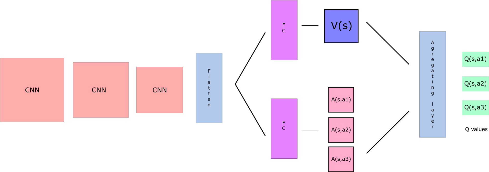
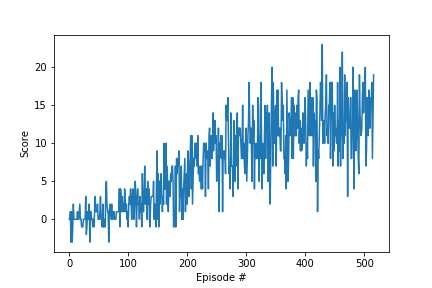
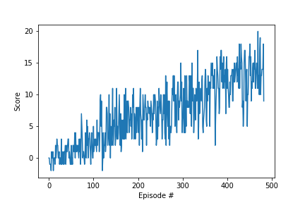

## Solution Video

## Learning Algorithm

My learning algorithm is a DuelingDQN.  
The idea behind a DuelingDQN is to use two streams. One for the state value function __V(s)__ and one that estimates the  
advantage vor each action __A(s,a)__. The first layers of the network like the convolutional layers share both streams,  
but then branch of into their own fully connected layers. The desired Q-values are obtained by combining the state and  
advantage values __Q(s,a) = V(s) + A(s,a)__.
The intuition behind it is that the value of most states don’t vary a lot accross actions.  
So it makes sense to try to estimate them directly, but we still need to capture the differences that actions make in  
each state. This is where the advantage function comes in.

More information in the [Dueling Networks](https://arxiv.org/abs/1511.06581) paper.   

### Hyperparameters
Parameter | Value
--- | ---
learning rate | 0.0005
replay memory | 100000
num episodes | 2000
batch size | 64
update every | 4
gamma | 0.99
tau | 0.001
epsilon start | 1.0
epsilon end | 0.01
epsilon decay | 0.995

### Model architecture

## Plot of Rewards

#### Q-Network + Replay Buffer
Episodes | Average Score
--- | ---
Episode 100|Average Score: 0.60
Episode 200|Average Score: 3.26
Episode 300|Average Score: 8.52
Episode 400|Average Score: 11.21
Episode 500|Average Score: 12.80
Episode 517|Average Score: 13.05
- |Environment solved in 417 episodes!	Average Score: 13.05

#### DuelingDQN  + Replay Buffer
Episodes | Average Score
--- | ---
Episode 100|Average Score: 0.88
Episode 200|Average Score: 4.39
Episode 300|Average Score: 7.50
Episode 400|Average Score: 10.83
Episode 447|Average Score: 13.00
- | Environment solved in 347 episodes!	Average Score: 13.00

## Ideas for Future Work

In my work a Dueling DQN was used to solve the problem. 
To improve the performance of the agent, an algorithm called [Rainbow](https://arxiv.org/abs/1710.02298) could be used.  
That has been tested by Google DeepMind Researchers.

The Rainbow algorithm is a combination of the following modifications:  
[Double DQN (DDQN)](https://arxiv.org/abs/1509.06461)  
[Dueling DQN](https://arxiv.org/abs/1511.06581)   
[Prioritized experience replay](https://arxiv.org/abs/1511.05952)  
[Distributional DQN](https://arxiv.org/abs/1710.10044)  
[Noisy DQN](https://arxiv.org/abs/1706.10295)  

